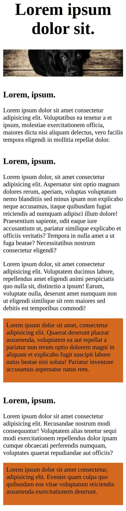

# Responsive Home Page

## Tutorial
[Introduction To Responsive Web Design](https://www.youtube.com/watch?v=srvUrASNj0s&t=1s)

## What I learned

- CSS
  - CSS units (`%` | `em` | `rem` | `px`)
  - Media queries (`max-width`)
  - Flexbox `order`
  - Negative margins
  - Using only `margin-bottom` and no `margin-top`
  - `object-fit` and `object-position` (these properties can be only used in certain situations)
  - [Organize css properties](https://9elements.com/css-rule-order)

## Screenshots

