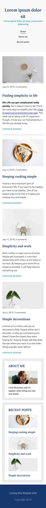
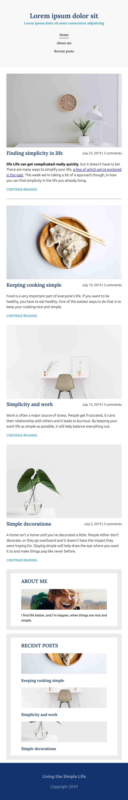
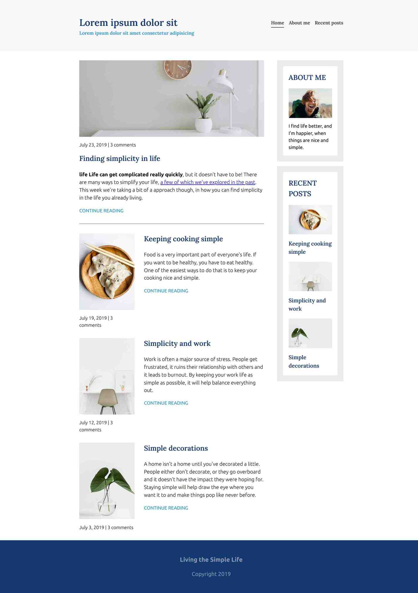

# Responsive Home Page

## Tutorial
[Introduction To Responsive Web Design](https://www.youtube.com/watch?v=srvUrASNj0s&t=1s)

## What I learned

- HTML
  - **Elements ordering that works without CSS.** In other words, order html elements with respect to meaning instead of styling. For example it might look nice to put article images above it's title, but it should be done in CSS and not HTML, for better accessibility and seperation of concerns.
  - Some naming conventions
- CSS
  - CSS units (`%` | `em` | `rem` | `px`)
  - Media queries (`min-width` | `max-width` | combinations)
  - Flexbox `order`
  - Negative margins
  - Using only `margin-bottom` and no `margin-top`
  - `object-fit` and `object-position` (these properties can be only used in certain situations)
  - [Organize css properties](https://9elements.com/css-rule-order)
- Mobile first design

## Screenshots

